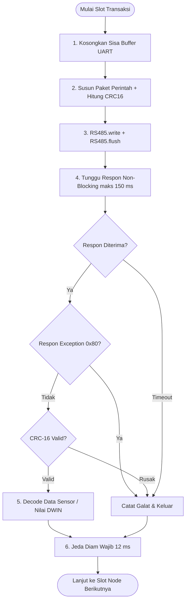

# Analisis Keandalan Komunikasi Modbus RTU (RS485) — HydroController

Dokumen ini menjelaskan secara teknis mengapa arsitektur komunikasi Modbus RTU pada proyek **HydroController ESP32** dapat berjalan dengan sangat lancar, stabil, dan bebas macet/tabrakan sinyal meskipun melayani **8 node sekaligus** (7 sensor industri + 1 layar DWIN HMI) dalam satu jalur bus bersama.

---

## 1. Masalah Umum Komunikasi RS485 / Modbus pada Arduino/ESP32

Pada implementasi mikrokontroler standar, komunikasi Modbus multi-node sering kali mengalami kendala berikut:
* **Tabrakan Data (*Data Collision*):** Beberapa node dipanggil tanpa isolasi waktu yang ketat, menyebabkan sinyal listrik di kabel A/B saling menabrak dan merusak frame data.
* **Sistem Membeku (*CPU Blocking*):** Penggunaan fungsi bawaan seperti `Serial.readBytes()` dengan timeout default 1000 ms menyebabkan seluruh program berhenti (freeze) tiap kali ada satu sensor yang mati atau dicabut.
* **Respon Terpotong (*Truncated Transmission*):** Pin DE/RE (arah transmisi) langsung dialihkan ke mode RX sebelum byte terakhir UART selesai keluar secara fisik dari register mikrokontroler.
* **Akumulasi Sampah (*Buffer Poisoning*):** Byte sisa dari pantulan sinyal, noise kabel panjang, atau respon yang terlambat tetap berada di buffer serial UART dan mencemari pembacaan transaksi berikutnya.

---

## 2. Tujuh (7) Pilar Keandalan Modbus pada HydroController

Sistem ini dirancang untuk mengatasi seluruh kelemahan di atas melalui 7 lapisan perlindungan teknis:

### 1. Penjadwalan Bergilir Terisolasi (*Time-Sliced Round-Robin*)
* **Kode Acuan:** [`HydroController.ino` (baris 1753–1781)](file:///e:/___backup/user/Documents/PROJECT%20PAK%20SEPTA/Firmware%20TERBARU/HydroController/HydroController.ino#L1753)
* **Mekanisme:** 
  Terdapat 8 slot waktu terisolasi (Slot 0 s/d 6 untuk Sensor 1–7, dan Slot 7 khusus untuk Layar DWIN HMI). Masing-masing node mendapat jatah waktu terdedikasi sebesar **125 ms**:
  $$\text{Slot Time} = \frac{\text{POLL\_INTERVAL\_MS}}{\text{TOTAL\_BUS\_SLOTS}} = \frac{1000\text{ ms}}{8} = 125\text{ ms}$$
* **Manfaat:** ESP32 bertindak sebagai **SATU-SATUNYA MASTER**. Tidak pernah ada dua transaksi yang berjalan bersamaan, sehingga fenomena tabrakan gelombang di kabel RS485 dicegah hingga 100%.

### 2. Penerapan Jeda Diam Wajib (*Silent Gap / Standar t3.5*)
* **Kode Acuan:** [`config.h` (baris 29–30)](file:///e:/___backup/user/Documents/PROJECT%20PAK%20SEPTA/Firmware%20TERBARU/HydroController/config.h#L29) & [`HydroController.ino` (baris 1779)](file:///e:/___backup/user/Documents/PROJECT%20PAK%20SEPTA/Firmware%20TERBARU/HydroController/HydroController.ino#L1779)
* **Mekanisme:**
  ```cpp
  #define MODBUS_GAP_MS 12 // jeda diam antar transaksi (>3.5 char @9600 baud)
  ```
  Standar resmi Modbus RTU mewajibkan jeda diam minimal $3.5$ karakter waktu (pada 9600 baud $\approx 3.65\text{ ms}$). Program menerapkan jeda aman **12 ms** setelah tiap transaksi selesai.
* **Manfaat:** Memberi ruang jeda bagi transceiver RS485 dan mikrokontroler sensor/DWIN untuk mengosongkan antrean internalnya dan kembali ke status IDLE sebelum frame berikutnya tiba.

### 3. Pembersihan Buffer Sampah Sebelum Kirim (*Buffer Purging*)
* **Kode Acuan:** [`HydroController.ino` (baris 178–179)](file:///e:/___backup/user/Documents/PROJECT%20PAK%20SEPTA/Firmware%20TERBARU/HydroController/HydroController.ino#L178)
* **Mekanisme:**
  ```cpp
  while (RS485.available())
    RS485.read(); // buang sisa frame lama / noise
  ```
* **Manfaat:** Tepat sebelum perintah baru dikirim, buffer penerimaan UART dikosongkan. Ini menjamin byte pertama yang diterima setelah perintah adalah murni respon perangkat yang sedang ditanya, bukan sampah dari transaksi sebelumnya.

### 4. Transmisi Tuntas dengan `RS485.flush()`
* **Kode Acuan:** [`HydroController.ino` (baris 185)](file:///e:/___backup/user/Documents/PROJECT%20PAK%20SEPTA/Firmware%20TERBARU/HydroController/HydroController.ino#L185) & [baris 259](file:///e:/___backup/user/Documents/PROJECT%20PAK%20SEPTA/Firmware%20TERBARU/HydroController/HydroController.ino#L259)
* **Mekanisme:**
  ```cpp
  RS485.write(req, len);
  RS485.flush(); // WAJIB tunggu hingga transmisi fisik selesai
  ```
* **Manfaat:** Perintah `flush()` mengunci eksekusi sampai bit stop UART terakhir benar-benar keluar ke kabel tembaga. Hal ini menghilangkan risiko paket perintah terpotong di tengah jalan akibat perpindahan mode arah kirim/terima (*DE/RE*).

### 5. Pembacaan Cepat Non-Blocking & Timeout Presisi
* **Kode Acuan:** [`HydroController.ino` (baris 189–202)](file:///e:/___backup/user/Documents/PROJECT%20PAK%20SEPTA/Firmware%20TERBARU/HydroController/HydroController.ino#L189)
* **Mekanisme:**
  * Program menghitung ekspektasi jumlah byte secara matematis:
    $$\text{expect} = 5 + (\text{qty} \times 2)$$
  * Pembacaan menggunakan loop dinamis berbasis milidetik (`millis() - t0 < MODBUS_TIMEOUT_MS`).
  * Begitu byte pas terkumpul (rata-rata hanya butuh 15–30 ms), fungsi langsung selesai seketika tanpa menunggu waktu timeout.
  * Bila sensor dicabut atau mati, batas waktu tunggu maksimum dibatasi hanya **150 ms**, sehingga siklus loop kendali pompa dan keselamatan (*relay guard*) tetap berjalan lancar.

### 6. Deteksi Dini Respon Kesalahan (*Exception Fast-Exit*)
* **Kode Acuan:** [`HydroController.ino` (baris 198–200)](file:///e:/___backup/user/Documents/PROJECT%20PAK%20SEPTA/Firmware%20TERBARU/HydroController/HydroController.ino#L198)
* **Mekanisme:**
  ```cpp
  if (n == 2 && (resp[1] & 0x80)) {
    break; // Frame Exception Modbus terdeteksi!
  }
  ```
* **Manfaat:** Jika perangkat mengirim respon error (misal menolak kode fungsi), bit ke-7 pada Function Code akan bernilai 1 (`0x80`). Program langsung menghentikan pembacaan di byte ke-2 tanpa harus menunggu timeout 150 ms habis sia-sia.

### 7. Verifikasi Keutuhan Bit dengan Checksum CRC-16
* **Kode Acuan:** [`HydroController.ino` (baris 146–154)](file:///e:/___backup/user/Documents/PROJECT%20PAK%20SEPTA/Firmware%20TERBARU/HydroController/HydroController.ino#L146) & [baris 228–232](file:///e:/___backup/user/Documents/PROJECT%20PAK%20SEPTA/Firmware%20TERBARU/HydroController/HydroController.ino#L228)
* **Mekanisme:**
  Setiap paket respon dihitung ulang menggunakan algoritma standar industri CRC-16 dengan polinom `0xA001`.
* **Manfaat:** Jika kabel RS485 terkena interferensi elektromagnetik dari motor pompa, inverter, atau relay, data yang cacat langsung dibuang dan dihitung sebagai kegagalan statistik (`busErr++`), bukan nilai acak yang membahayakan tanaman.

---

## 3. Komparasi: Cara Amatir vs Cara Industri HydroController

| Parameter | Pendekatan Konvensional / Amatir | Pendekatan Industri (HydroController) |
| :--- | :--- | :--- |
| **Pola Transaksi** | Acak / bersamaan (*Asynchronous Request*) | Terjadwal bergiliran (*Time-Sliced Round-Robin*) |
| **Waktu Tunggu (Timeout)** | `delay(1000)` / `Serial.setTimeout(1000)` | Berbasis `millis()` non-blocking (maks 150 ms) |
| **Kondisi Sensor Mati** | Seluruh sistem membeku selama 1 detik | Sensor ditandai gagal, loop lanjut dalam <150 ms |
| **Jeda Antar Paket** | Tidak ada / asal jalan | Jeda teratur 12 ms (>3.5 karakter standar Modbus) |
| **Penanganan Buffer** | Dibiarkan menumpuk (*Buffer Overflow*) | Dikosongkan sebelum tiap transaksi kirim |
| **Integritas Data** | Diterima mentah tanpa cek CRC | Diverifikasi bit-per-bit dengan CRC-16 |
| **Kompatibilitas Layar DWIN** | Memaksa FC 0x10 dan gagal total | Fallback cerdas ke FC 0x06 (Write Single) |

---

## 4. Diagram Alur Transaksi per Siklus



---

## 5. Kesimpulan Teknis

Kelancaran komunikasi Modbus pada sistem HydroController bukan terjadi secara kebetulan, melainkan hasil dari **disiplin pewaktuan (*deterministic timing*)**, **pembersihan jalur komunikasi secara berkala**, serta **toleransi tinggi terhadap anomali perangkat keras**. Dengan arsitektur ini, sistem mampu beroperasi nonstop 24/7 tanpa risiko *bus lockup* atau data korup.
